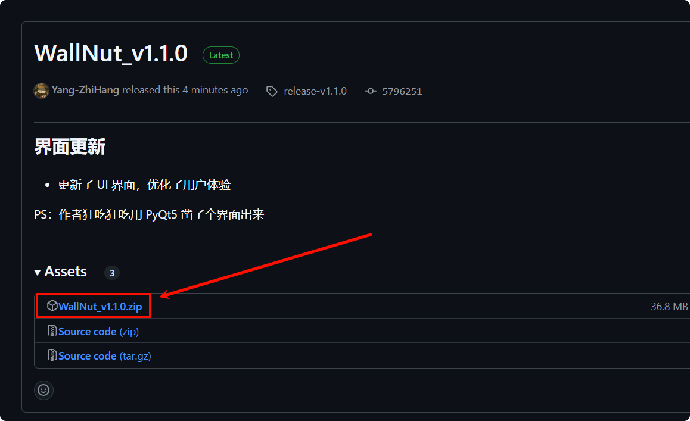
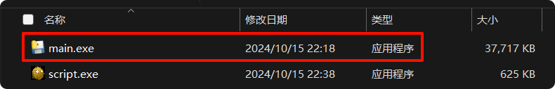

    <h1>
        一键评教 WallNut 版
    </h1>
    本资源仅供学习交流使用，严禁用于商业与非法用途，请于24小时内删除。
     
    本程序初衷仅用于学习 VBS 脚本的编写和小应用的开发。

---

    据说西电貌似有个要求: 不评教不能查看学期考成绩。
     
    But: "这么多教师，每个教师我都想选非常满意，全部评完得十几分钟。"
     
    于是乎作者写了段 VBS 脚本🤔，实现了自动评教的功能，并编译为可执行程序。

---

### 🚀 更新概况 🚀

- **2024 年 10 月 15 日**：更新了 UI，优化了用户体验
- **2024 年 10 月 14 日**：添加了部分功能

---

## 食用说明

**1. 下载 releases 最新版的压缩包**

**2. 解压压缩包**

这个不用我说了吧 QwQ

解压至随便哪个目录都可以，你喜欢就行

**3. 运行 main.exe 文件即可**

