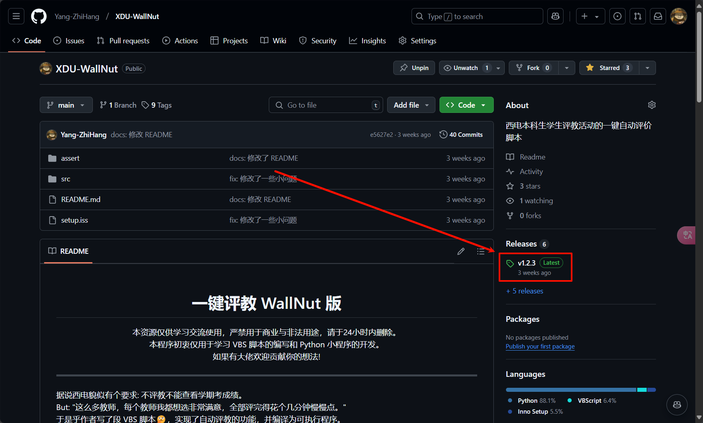
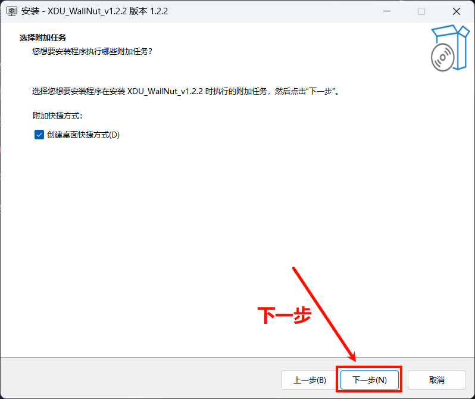
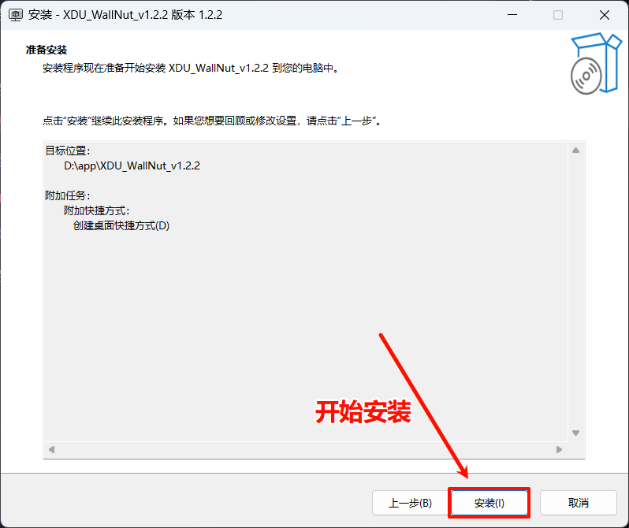
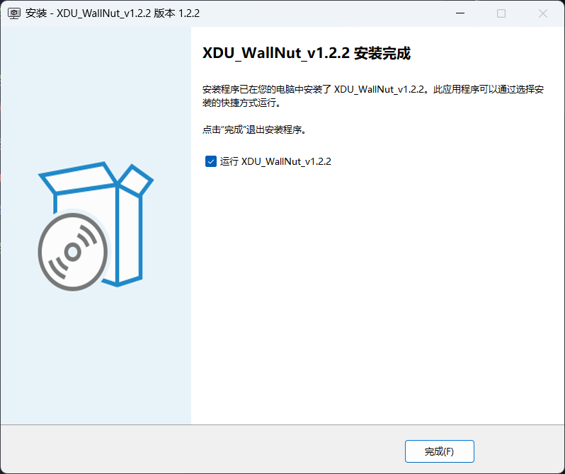
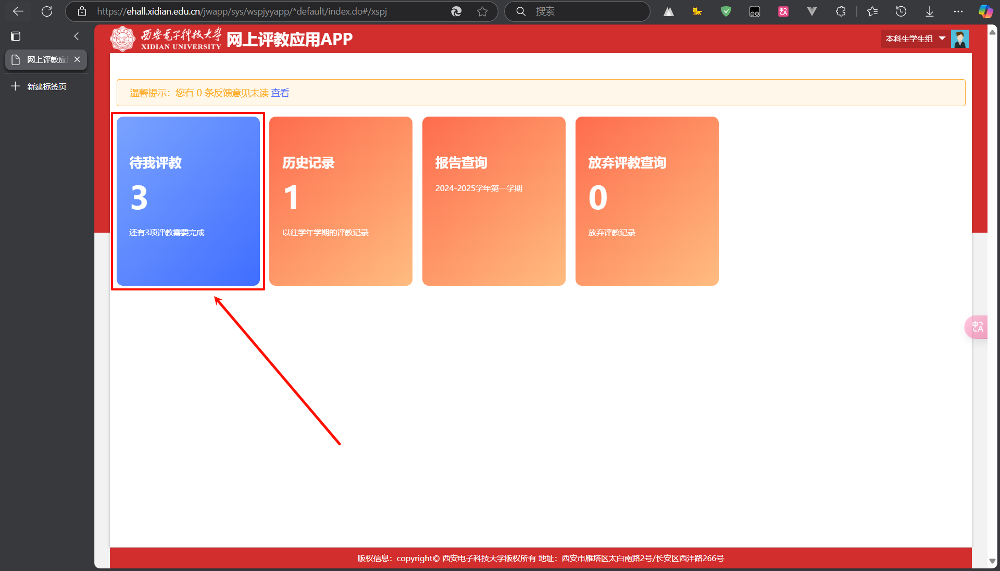
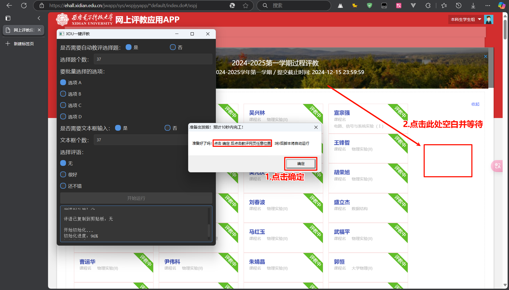
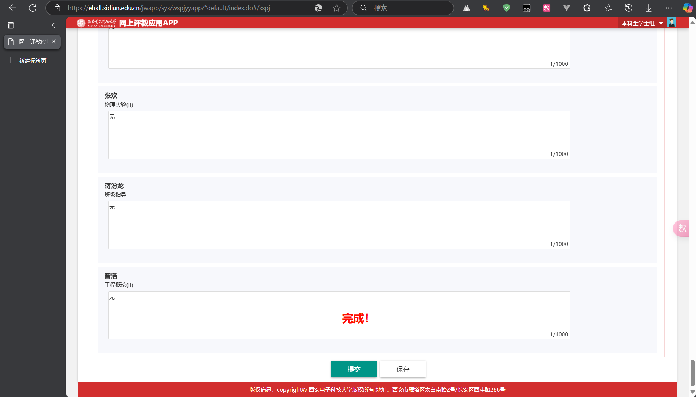

  <h1 align="center">一键评教 WallNut 版</h1>

  

> ⚠️ 免责声明:
> 1. 本程序仅供学习交流使用，严禁用于商业和非法用途
> 2. 本程序开发初衷是学习 Python 编程和自动化脚本
> 3. 本程序无意影响评教的真实性。如果您认为程序的某些功能可能影响教学评价的客观性，请随时与作者联系
> 4. 使用本程序产生的任何后果由使用者自行承担
> 5. 请在下载后24小时内删除本程序

## 📝 项目起源

> 据说西电貌似有个要求: 不评教不能查看学期考成绩 🤔
>
> "这么多教师，每个教师我都想选非常满意，但是全部评完得花个把分钟。" 😫
>
> 于是乎作者写了段 Python 脚本(已经不是VBS了😭)，实现了自动评教的功能，并编译为可执行程序 ✨

## 🚀 更新日志

| 日期 | 更新内容 |
|------|----------|
| 2024-12-14 | • 重构代码结构 • 添加分页功能 • 添加增强功能 • 更新 UI |
| 2024-11-18 | • 添加自动检查更新功能 |
| 2024-11-17 | • 优化用户界面 • 增加代码可维护性 |
| 2024-10-19 | • 修复若干 bug |
| 2024-10-15 | • 更新 UI • 优化用户体验 |
| 2024-10-14 | • 添加部分功能 |

## 📖 快速开始

### 1. 下载最新版应用程序

选择包含 `setup` 的 `exe` 文件下载

### 2. 安装程序

选择合适的安装目录 💗

按照提示完成安装 🤪

### 3. 运行程序

如果你没有选择安装完成后自动运行，可以从目录进入，双击 `XDU_WallNut.exe` 即可运行

运行后会自动跳转到评教页面（如果你没有登录过的话，需要手动登录）

### 4. 评教

[第一步] 进入评教页面

[第二步] 根据评教信息，填入信息

[第三步] 点击评教按钮，等待评教完成

[第四步] 提交！

