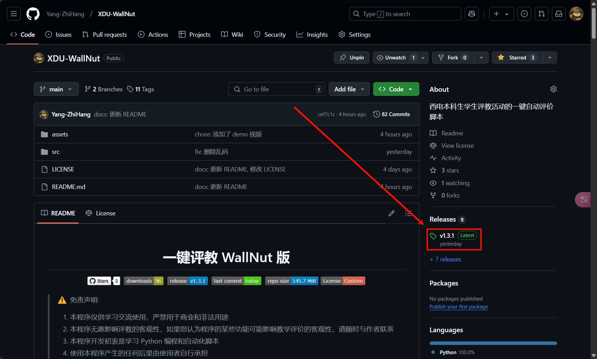
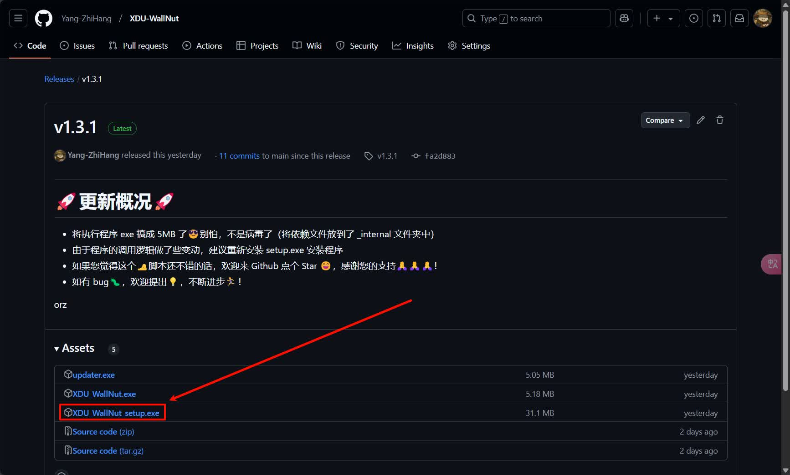
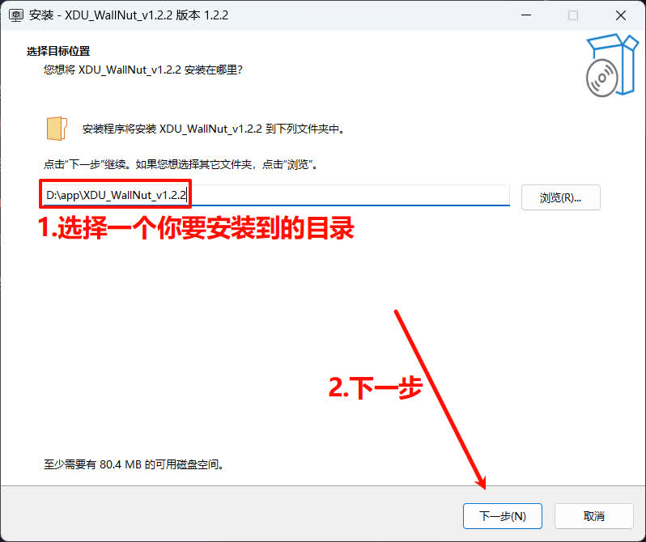
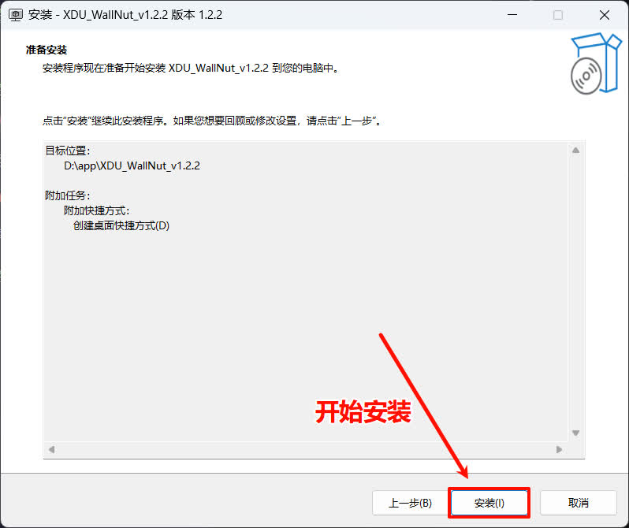
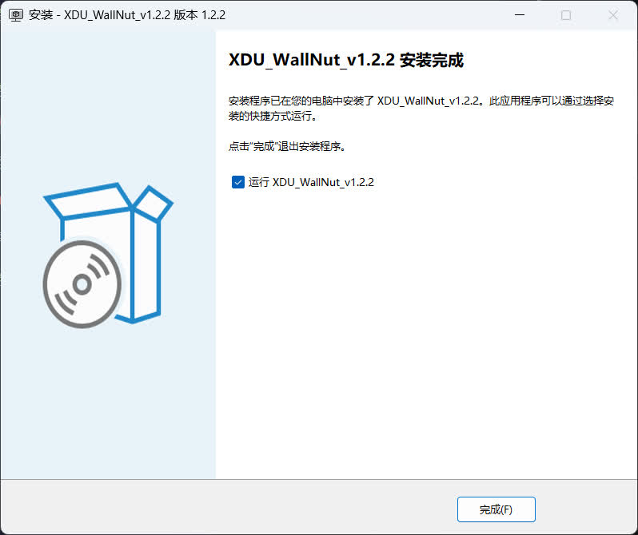
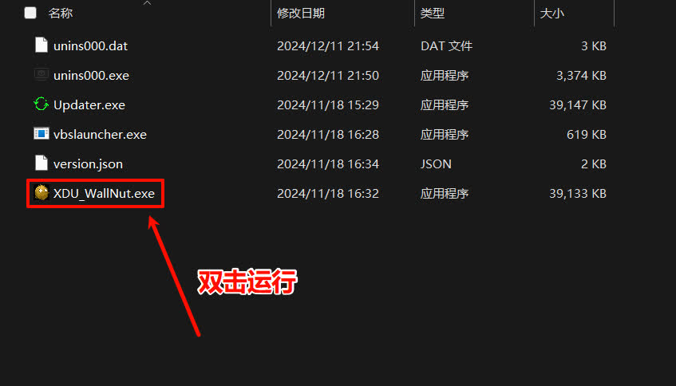
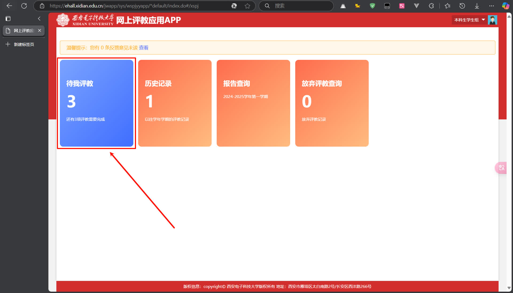
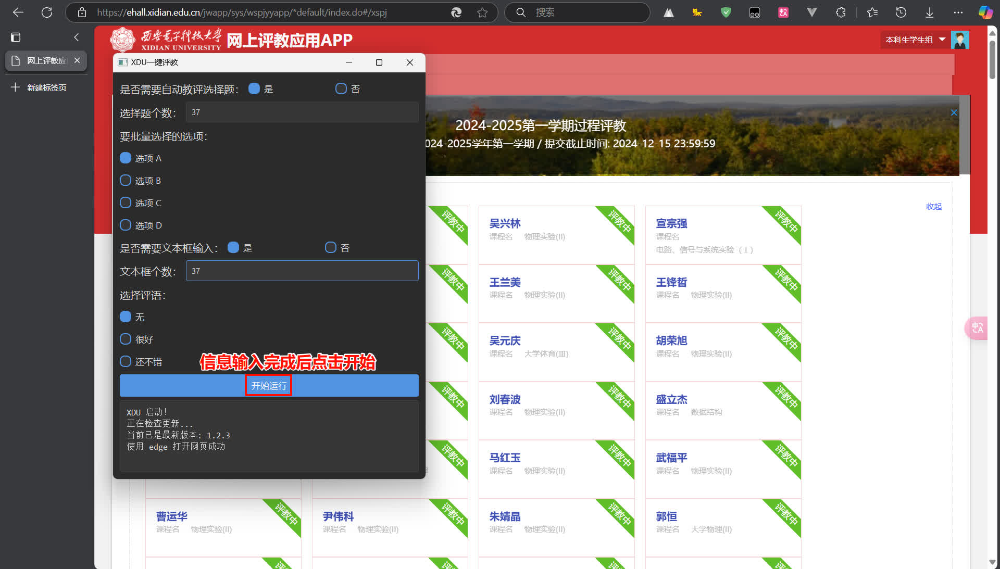
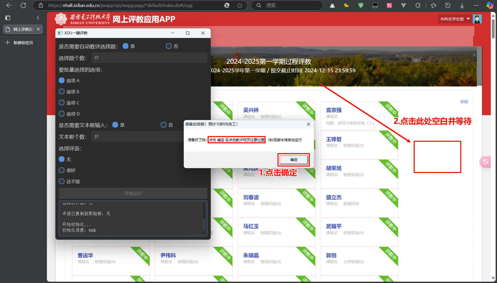
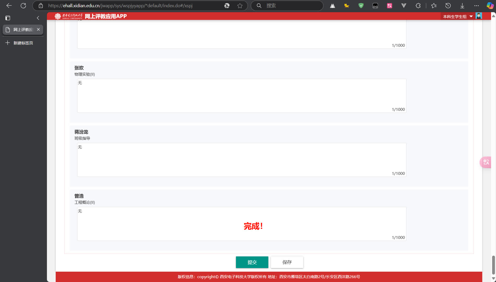

  <h1 align="center">预评教 WallNut 版</h1>

  &nbsp;
  &nbsp;
  &nbsp;
  &nbsp;
  
  

> ⚠️ 免责声明:
>
> 1. 本程序仅供学习交流使用，严禁用于商业和非法用途
> 2. 本程序无意影响评教的客观性
> 3. 本程序开发初衷是学习 Python 编程和自动化脚本
> 4. 使用本程序产生的任何后果由使用者自行承担
> 5. 请在下载后 24 小时内删除本程序

## 📝 项目起源

> 据说西电貌似有个要求: 评教后才能查看学期考成绩 🤔
>
> "这么多教师，我希望所有教师都自动选上一般满意，在此基础之上，手动对个别老师依据客观事实选择非常满意或其他" 🎯 💭
>
> 于是乎作者写了段 Python 脚本(已经不是 VBS 了 😭)，实现了此功能，并编译为可执行程序 💻

## 🚀 更新日志

> **2025-01-06**
>
> - 🔔更新了 "期末评教" 的交互模式，只需要填写一次评教的老师个数
> - 🔧优化了代码逻辑
> - ⚙️ 在用户设置界面添加了下次使用时是否自动打开网页
> - 🎨 调整了一捏捏 UI 的样式

---

> **2024-12-31**
>
> - 🔄 将 "普通模式" 和 "增强模式" 分别重命名为 "实验评教" 和 "期末评教"，使界面更加直观友好
> - 🔔 新增执行失败时的弹窗提示功能，提升用户体验

---

> **2024-12-14**
>
> - 🔧 重构代码结构
> - 📄 添加分页功能
> - ⚡️ 添加增强功能（允许自动评教多个不同答案的选择题）
> - 🎨 更新 UI

---

> **2024-11-18**
>
> - 🔄 添加自动检查更新功能

---

> **2024-11-17**
>
> - 💫 优化用户界面
> - 📦 增加代码可维护性

---

> **2024-10-19**
>
> - 🐛 修复若干 bug

---

> **2024-10-15**
>
> - 🎨 更新 UI
> - ✨ 优化用户体验

---

> **2024-10-14**
>
> - 🎉 添加部分功能

## 📖 快速开始

### 1. 下载最新版应用程序

选择包含 `setup` 的 `exe` 文件下载

### 2. 安装程序

选择合适的安装目录 💗

按照提示完成安装 🤪

### 3. 运行程序

如果你没有选择安装完成后自动运行，可以从目录进入，双击 `XDU_WallNut.exe` 即可运行

运行后会自动跳转到评教页面（如果你没有登录过的话，需要手动登录）

### 4. 评教

[第一步] 进入评教页面

[第二步] 根据评教信息，填入信息

[第三步] 点击评教按钮，等待评教完成

[第四步] 提交！

## 📄 许可证

本项目采用自定义许可证。

主要条款：

- ✅ 允许个人免费使用、修改和分发
- ✅ 仅限用于个人学习和非商业用途
- ✅ 必须保留原始版权声明
- ❌ 禁止任何形式的商业使用
- ❌ 作者不承担任何责任

详细条款请查看 [LICENSE](LICENSE) 文件。
